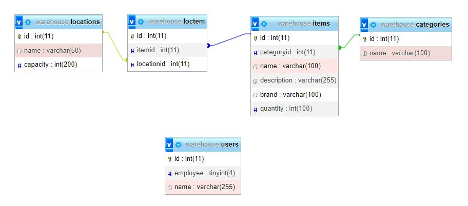
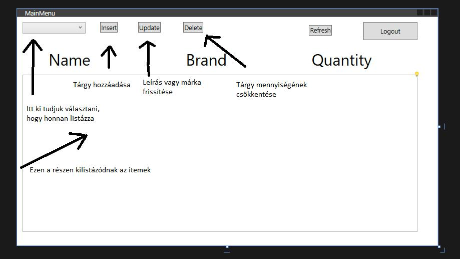

# A program rövid ismertetése

A program egy raktárkezelő alkalmazás, létre lehet hozni felhasználót és megadni, hogy alkalmazott-e. Az alkalmazásban van lehetőséged tárgyak hozzáadására, frissítésére, illetve törlésére attól függően, hogy erre megvan-e az engedélyed.

# Adatbázis

Az adatbázis öt táblát tartalmaz.Van egy felhasználó(users) tábla, ami eltárolja a felhasználó nevét és, hogy ott dolgozik-e vagy sem, mivel ha valaki nem ott dolgozó csak korlátozott jogosultságot kap.
A tárgyak(items) tábla tárolja a tárgyak elnevezését, márkáját, egy rövid leírást és hogy mennyi van az adott tárgyból. A tábla meghívja a kategóriákat(categories) ami a kategória nevét tartalmazza.
Az utolsó fő tábla a elhelyezési körlet(locations) tábla ez tárolja a helyszínek nevét és, hogy hány tárgyat lehet odatenni.
Az items és locations táblát a loctem tábla köti össze, ez arra szolgál hogyha több tárgyat egy helyre, illetve egy tárgyat több helyre szeretnénk tenni akkor az megoldható legyen.



# Adatbázis összekapcsolása

Az adatbázis összekapcsolásához, először letöltöttük, illetve beimportáltuk a MySql.Data library-t. Ezután létrehoztunk egy DataBaseConnect class-t.

```cs
public class DataBaseConnect
{
    string server = "localhost";
    string database = "warehouse"; //Name of the database
    string uid = "root";
    string password = "";
    private MySqlConnection connection;

    // Constructor
    public DataBaseConnect()
    {
        Initialize(server, database, uid, password);
    }
```

Beállítjuk a DataBaseConnect class Fieldjeit, amik az adatbázis tulajdonságait tárolják.

```cs
// Initialize values
private void Initialize(string server, string database, string uid, string password)
{
    string connectionString = $"SERVER={server};DATABASE={database};UID={uid};PASSWORD={password};";
    connection = new MySqlConnection(connectionString);
}

// Open the connection
public void OpenConnection()
{
    if (connection.State == System.Data.ConnectionState.Closed)
    {
        connection.Open();
    }
}

// Close the connection
public void CloseConnection()
{
    if (connection.State == System.Data.ConnectionState.Open)
    {
        connection.Close();
    }
}

public MySqlDataReader ExecuteQuery(string query)
{
    MySqlCommand cmd = new MySqlCommand(query, connection);
    return cmd.ExecuteReader();
}
```

Létrehoztunk egy Initialize methodot, ami inicializálja a connection stringet, amit aztán meghív a Constructor.

# Regisztráció/Bejelentkezés

A bejelentkezés és a regisztráció nem sokban különböznek egymástól.
Míg a bejelentkezés csak megnézi, hogy létezik-e az adott néven felhasználó és ha létezik, akkor megnézi, hogy létezik-e employee jogosultsággal.
Viszont a regisztráció abban az esetben, ha a felhasználónév még nem létezik feltölti az adatbázisba a megadott nevet és hogy milyen jogosultsága van utána meg automatikusan bejelentkezteti a korábbi adatokkal.

# SQL Injection elleni védelem

Az SQL injection ellen a projectünkben paraméterezett lekérdezéseket (parameterized queries) használtunk. Ennek a lényege, hogy a lekérdezésbe beillesztett adatokat paraméterként adjuk át. Például:

```cs
string newitem = "INSERT INTO `items`( `categoryid`, `name`, `description`, `brand`, `quantity`)" +
    " VALUES (@categoryid,@name,@desc,@brand,@qty)";
```

Ezután paraméterként átadjuk az értékeket:

```cs
MySqlCommand newitemcmd = new MySqlCommand(newitem,db.GetConnection());
newitemcmd.Parameters.AddWithValue("@categoryid", category);
newitemcmd.Parameters.AddWithValue("@name", name);
newitemcmd.Parameters.AddWithValue("@desc", desc);
newitemcmd.Parameters.AddWithValue("@brand", brand);
newitemcmd.Parameters.AddWithValue("@qty", qty);
newitemcmd.ExecuteNonQuery();
```

A Query így fog kinézni, amibe a programunk behelyettesít:

```sql
INSERT INTO (`items`, `name`, `description`, `brand`, `quantity`) VALUES (@categoryid, @name, @desc, @brand, @qty);
```

# Főmenü

A belépés után megnyílik a főmenü



# Tárgy hozzáadása

Tárgyat csak az ott dolgozó adhat hozzá, a hozzáadás működése egészen egyszerű a felhasználó megadja a szükséges információkat és hogy hova szeretné tenni a tárgyat és hogy mennyit.Abban az esetben, ha ugyan azon a helyen már van ugyan olyan tárgy akkor csak növeli az ott lévő tárgyak mennyiségét, viszont, ha nincs akkor csak feltölti az adatbázisba az adatokat és a darabszámot.
Ha van ilyen tárgy már az adatbázisban:

```cs
//megnézi hogy van e már ilyen tárgy
string query = $"SELECT * FROM `items`" +
    $"Inner Join loctem on loctem.itemid=items.id " +
    $"INNER Join locations On loctem.locationid=locations.id " +
    $" WHERE categoryid={category} AND items.name = \"{name}\" AND brand=\"{brand}\" AND locations.id={location} ";
MySqlDataReader read = db.ExecuteQuery(query);
if (read.Read())
{
    string id = read["id"].ToString()!;
    read.Close();
    string query2= $"SELECT SUM(items.quantity) as endqty FROM `items`Inner Join loctem on loctem.itemid=items.id INNER Join locations On loctem.locationid=locations.id WHERE locations.id={location} GROUP BY loctem.locationid;";
    MySqlDataReader read2 = db.ExecuteQuery(query2);
    read2.Read();
    int endqty = int.Parse(read2["endqty"].ToString()!);
    read2.Close();
    string query3 = $"Select * from `locations` WHERE id = {location}";
    MySqlDataReader read3 = db.ExecuteQuery(query3);
    read3.Read();
    int maxqty = int.Parse(read3["capacity"].ToString()!);
    read3.Close();
    if (maxqty >= endqty+qty)
    {
    string update_quantity = $"UPDATE `items` SET `quantity`='{(endqty+qty)}' WHERE id={id}";
    MySqlCommand update = new MySqlCommand(update_quantity,db.GetConnection());
        update.ExecuteNonQuery();
    }
    else
    {
        MessageBox.Show("The location can't hold that many items");
    }
```

Természetesen a program megnézi, hogy az adott területen még van-e férőhely, mivel, ha az be van telve vagy be fog telni ezzel a hozzáadással akkor nem engedi, hogy odategyünk annyi tárgyat és visszaadja a felhasználónak, hogy mennyi szabad hely van az adott területen.
Ha nincs ilyen típusú elem az adatbázisban:

```cs
read.Close();
string query2 = $"SELECT SUM(items.quantity) as endqty FROM `items" +
    $"`Inner Join loctem on loctem.itemid=items.id" +
    $" INNER Join locations On loctem.locationid=locations.id" +
    $" WHERE locations.id={location} GROUP BY loctem.locationid;";
MySqlDataReader read2 = db.ExecuteQuery(query2);
read2.Read();
int endqty = int.Parse(read2["endqty"].ToString()!);
read2.Close();
string query3 = $"Select * from `locations` WHERE id = {location}";
MySqlDataReader read3 = db.ExecuteQuery(query3);
read3.Read();
int maxqty = int.Parse(read3["capacity"].ToString()!);
read3.Close();
if (maxqty >= endqty + qty)
{
    string newitem = "INSERT INTO `items`( `categoryid`, `name`, `description`, `brand`, `quantity`)" +
        " VALUES (@categoryid,@name,@desc,@brand,@qty)";
    MySqlCommand newitemcmd = new MySqlCommand(newitem,db.GetConnection());
    newitemcmd.Parameters.AddWithValue("@categoryid", category);
    newitemcmd.Parameters.AddWithValue("@name", name);
    newitemcmd.Parameters.AddWithValue("@desc", desc);
    newitemcmd.Parameters.AddWithValue("@brand", brand);
    newitemcmd.Parameters.AddWithValue("@qty", qty);
    newitemcmd.ExecuteNonQuery();
    MessageBox.Show(newitem);
    string item = $"SELECT * FROM `items` WHERE name=\"{name}\" and brand=\"{brand}\"";
    MySqlDataReader read4 = db.ExecuteQuery(item);
    read4.Read();
    string id = read4["id"].ToString()!;
    read4.Close();
    string newloctem = $"INSERT INTO `loctem`(`itemid`, `locationid`) VALUES ({id},{location})";
    MySqlCommand locteminsert = new MySqlCommand(newloctem,db.GetConnection());
    locteminsert.ExecuteNonQuery() ;

}
else
{
    MessageBox.Show("The location can't hold that many items");
}
```

# Tárgy frissítése

A főmenün kiválasztott tárgy leírását és márkáját lehet itt változtatni, ha a felhasználó nem add meg értéket akkor nyilvánvalóan nem fog változás történni. Illetve lehet csak a leírást vagy csak a márkát külön frissíteni.
Először átkérjük, a user által kiválasztott itemet a listboxbol, illetve ha a user nem választott ki semmit, akkor visszaküldjük és értesítjük, hogy válasszon:

```cs
private void UpdateButton_Click(object sender, RoutedEventArgs e)
{
    if (items.SelectedItem == null)
    {
        MessageBox.Show("Please select an item to update.");
        return;
    }

    // Get the selected item's name
    string selectedItem = items.SelectedItem.ToString();
    string[] itemParts = selectedItem.Split(' '); // Split the item name into its components

    if (itemParts.Length < 2)
    {
        MessageBox.Show("Invalid item format.");
        return;
    }

    string name = itemParts[0]; // Get the name part
    string brand = itemParts[1]; // Get the brand part

    // Create and open the UpdateElementWindow
    UpdateElementWindow update = new UpdateElementWindow();
    update.SelectedName = selectedItem; // Pass the selected item's name to the new window
```

Ezt követően felépítjük a query-t az alapján, hogy a felhasználó a márkát, a leírást vagy mindkettőt szeretné frissíteni (updatelni):

```cs
if (items.SelectedItem == null)
{
    MessageBox.Show("Please select an item to update.");
    return;
}

// Get the selected item's name
string selectedItem = items.SelectedItem.ToString();
string[] itemParts = selectedItem.Split(' '); // Split the item name into its components

if (itemParts.Length < 2)
{
    MessageBox.Show("Invalid item format.");
    return;
}

string name = itemParts[0]; // Get the name part
string brand = itemParts[1]; // Get the brand part

// Create and open the UpdateElementWindow
UpdateElementWindow update = new UpdateElementWindow();
update.SelectedName = selectedItem; // Pass the selected item's name to the new window

try
{
    if (update.ShowDialog() == true)
    {
        string newBrand = update.NewBrand.Text;
        string newDescription = update.NewDescription.Text;

        // Construct the SQL query based on user input
        string updateQuery = "UPDATE items SET";
        List<string> updateStatements = new List<string>();

        if (!string.IsNullOrEmpty(newBrand))
        {
            updateStatements.Add($"brand = '{newBrand}'");
        }

        if (!string.IsNullOrEmpty(newDescription))
        {
            updateStatements.Add($"description = '{newDescription}'");
        }

        if (updateStatements.Count > 0)
        {
            updateQuery += " " + string.Join(", ", updateStatements);
            updateQuery += $" WHERE name = '{name}' AND brand = '{brand}'";

            // Execute the SQL query to update the item in the database
            MySqlCommand updateCommand = new MySqlCommand(updateQuery, db.GetConnection());
            int rowsAffected = updateCommand.ExecuteNonQuery();

            if (rowsAffected > 0)
            {
                MessageBox.Show($"Item updated successfully.");
            }
            else
            {
                MessageBox.Show($"Failed to update item '{name}'.");
            }
        }
        else
        {
            MessageBox.Show("No changes to update.");
        }
    }
}
catch (Exception ex)
{
    MessageBox.Show($"An error occurred: {ex.Message}");
}
```

# Tárgy törlése

A törlést nem szó szerint kell érteni itt csupán a kiválasztott tárgy mennyiséget lehet csökkenteni az adott helyen, ez mindenki számára engedélyezett.
Kilistázzuk az elérhető tárgyakat (itemeket) ahonnan lehet törölni:

```cs
private void Window_Loaded(object sender, RoutedEventArgs e)
{
    try
    {
        db.OpenConnection();
        // Populate the ComboBox with items from the database
        string itemQuery = "SELECT name FROM items"; // Adjust your query as needed
        MySqlDataReader itemReader = db.ExecuteQuery(itemQuery);

        while (itemReader.Read())
        {
            Items.Items.Add(itemReader["name"].ToString());
        }

        itemReader.Close();

        // Populate the ComboBox with locations from the database
        string locationQuery = "SELECT name FROM locations"; // Adjust your query as needed
        MySqlDataReader locationReader = db.ExecuteQuery(locationQuery);

        while (locationReader.Read())
        {
            Locations.Items.Add(locationReader["name"].ToString());
        }

        locationReader.Close();

    }
    catch (Exception ex)
    {

        MessageBox.Show("An error occured while populating ComboBoxes: " + ex.Message);
    }
    finally
    {
        db.CloseConnection();
    }
}
```

Csökkentjük a tárgy mennyiségét a raktárban, illetve a helyen ahol tároltuk, illetve a delete click method fogja meghívni:

```cs
public void DeleteItem(int location, string name, int quantity)
{
    try
    {
        // Check if the item exists in the specified location
        string query = $"SELECT items.id, items.quantity FROM `items` " +
            $"INNER JOIN loctem ON loctem.itemid = items.id " +
            $"INNER JOIN locations ON loctem.locationid = locations.id " +
            $"WHERE locations.id = {location} AND items.name = \"{name}\"";

        MySqlDataReader read = db.ExecuteQuery(query);

        if (read.Read())
        {
            int itemId = Convert.ToInt32(read["id"]);
            int itemQuantity = Convert.ToInt32(read["quantity"]);
            read.Close();

            if (itemQuantity >= quantity)
            {
                // Update the quantity of the item
                string updateQuantity = $"UPDATE `items` SET `quantity` = {itemQuantity - quantity} WHERE id = {itemId}";
                MySqlCommand update = new MySqlCommand(updateQuantity, db.GetConnection());
                update.ExecuteNonQuery();
                MessageBox.Show($"Successfully deleted {quantity} items of {name} in the specified location.");

            }
            else
            {
                MessageBox.Show($"Not enough quantity of the item to delete. There are {itemQuantity} items matching the criteria.");

            }
        }
        else
        {
            read.Close();
            MessageBox.Show("Item not found in the specified location.");

        }
    }
    catch (Exception ex)
    {
        MessageBox.Show("An error occurred: " + ex);

    }
}
```

Lekérjük az item location id-ját a GetLocationId method-dal, amit a Delete_Click method fog használni.

```cs
private int GetLocationId(string locationName)
{
    int locationId = 0;
    try
    {
        string query = $"SELECT id FROM locations WHERE name = '{locationName}'";
        MySqlCommand cmd = new MySqlCommand(query, db.GetConnection());
        MySqlDataReader reader = cmd.ExecuteReader();

        if (reader.Read())
        {
            locationId = Convert.ToInt32(reader["id"]);
        }

        reader.Close();
    }
    catch (Exception ex)
    {

        MessageBox.Show("An error occurred while getting location ID: " + ex.Message);
    }
    return locationId;
}
```

Legvégül lefut a delete click, ha megnyomjuk a gombot:

```cs
private void Delete_Click(object sender, RoutedEventArgs e)
{
    try
    {
        string itemName = Items.SelectedItem.ToString()!;
        string locationName = Locations.SelectedItem.ToString()!;
        int quantity = int.Parse(Quantity.Text);

        db.OpenConnection();

        int locationId = GetLocationId(locationName);

        // Call the DeleteElement class to perform the delete operation
        DeleteElement deleteElement = new DeleteElement(db);
        deleteElement.DeleteItem(locationId, itemName, quantity); // Pass locationId instead of location
        BasicUserInterFace basicUserInterface = new BasicUserInterFace();
        basicUserInterface.Show();
        this.Close();
    }
    catch (Exception ex)
    {
        MessageBox.Show("An error occurred: " + ex.Message);
    }
    finally
    {
        db.CloseConnection();
    }
}
```
